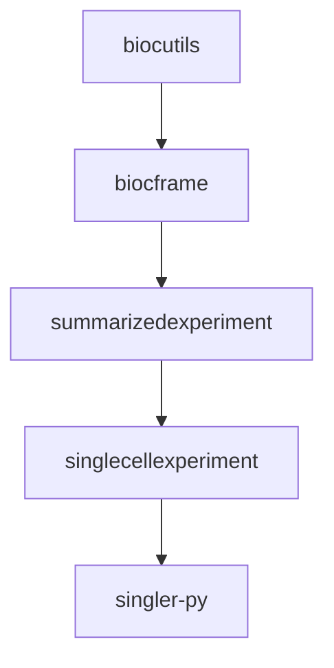

再上次尝试了对conda-forge的包做小贡献之后，我想继续来点更进阶的：尝试将 [singler‑py](https://github.com/SingleR-inc/singler-py) 这个 Python 包发布到 conda 生态中，结果不做不知道，一做... 还有点麻烦...

<!-- more -->

## 罗马并不能一天建成

我原本以为，设置好recipe，一次提交，通过审核就行了，但是发现了如下问题：

- 原本打算直接提交到 **conda‑forge**，却在阅读贡献指南时发现：专门面向生物信息学的软件应当优先提交到 **Bioconda** 频道。
- 之后阅读**Bioconda**的文档并尝试逐步尝试，发现 singler‑py 依赖的不少包都未进入任何 conda 频道，AI告诉我官方并不建议在同一个 PR 中提交多个新包，因此我只能从依赖树的最底层开始一个个来。
- 逐级往下解析，发现BiocPy下的一系列包都是没有进入Conda生态的... 梳理起来，从最底层的 biocutils开始，然后基础的 `biocframe`，再到数据结构的`summarizedexperiment`，最后才能到实际上应用层的`singler‑py`

梳理依赖后，singler‑py 所需的构建工作实际上是一个层层递进的依赖树。从最底层的 **biocutils** 开始，向上构建 **biocframe**、**summarizedexperiment** 和 **singlecellexperiment**，最后才是 **singler‑py** 本身。就目前来说，已知的依赖树就有：



从图中可以看出，完成 singler‑py 的 conda 发布需要至少 **4 个层级**的构建工作，假设审核周期为 2‑3 个工作日，整个链条将耗时约 2‑3 周。实际上应该会在过程中发现更多的依赖包... 估计只长不短...

## conda-forge和Bioconda不同的recipe工作流

由于这个中实际上了解了两边的工作流，所以记录一下。

### conda‑forge 与 Bioconda 简介

[conda‑forge](https://conda-forge.org/) 是一个由社区主导的 conda 软件包仓库，它覆盖了绝大多数通用领域的开源软件。任何人都可以通过 GitHub 向它的 [staged‑recipes](https://github.com/conda-forge/staged-recipes) 仓库提交新的配方（recipe），经过自动化检查和维护者审核后，新包就会出现在 `conda‑forge` 频道中，供全球用户通过 `conda install -c conda-forge <package>` 安装。

[Bioconda](https://bioconda.github.io/) 则是一个专注于生物信息学软件的 conda 频道，是一个专门收录生物相关包的仓库，文档里也特别强调，如果一个包并不专门服务于生物相关的目的，那么它应该被提交到`conda‑forge` 频道。

两者管理和生成 Recipe 的工具有重合，但是实际上两者的Recipe整理方式不太一样。`conda‑forge`准备了一个recipe 模板，提交recipe后，CI工作流会生成 feedstock 仓库，后续的维护工作在 feedstock 仓库上进行，所以是一包一库的形式。

Bioconda则是所有recipe集中在一个仓库，直接向这个集中仓库提交PR就好。差异应该来自于包的数目吧，毕竟生物信息应该是数据科学的分支，所以工具的数量应该远小于前者，愿意维护和贡献的人的数量... 估计更是远小于前者了... （有代码用就不错了... 标准化和打包别想太多）

### 工具准备

本次我暂时是使用conda工具集，毕竟初上手，跟着官方文档走... 所有的工具pixi都可以获取，运行：

```bash
pixi global install --environment conda -c conda-forge -c bioconda conda conda-build bioconda-utils greyskull grayskull 
```

这里有个小彩蛋，greyskull和grayskull同时存在，其实都指向的是grayskull，bioconda的文档有一页提到的是greyskull，不知道是不是项目开始的时候出现了什么小错误...

### 向 conda‑forge 提交新包的简要步骤

conda‑forge 的方式是先提交 recipe，生成 feedstock 再维护feedstock

1. **Fork 仓库**  
   访问 [conda‑forge/staged‑recipes](https://github.com/conda-forge/staged-recipes) 并点击 “Fork” 按钮，将仓库复制到自己的 GitHub 账号下。

2. **准备本地环境**  
   克隆你 fork 后的仓库，并创建一个新分支：
   ```bash
   git clone https://github.com/<你的用户名>/staged-recipes.git
   cd staged-recipes
   git checkout -b add-<包名>
   ```

3. **生成配方文件**  
   像我提交的是pypi本来就有的包，所以直接`grayskull pypi --strict-conda-forge <包名>`就可以了

4. **本地验证**  
   使用 `conda smithy` 工具在本地运行 lint 和构建测试（需先安装 `conda‑smithy`）：
   ```bash
   conda smithy recipe-lint recipes/<包名>/
   conda build recipes/<包名>/
   ```

5. **提交 PR**  
   将修改推送到你的 fork，然后在 GitHub 界面向 `conda‑forge/staged‑recipes` 发起 Pull Request。CI 会自动运行多平台构建测试，维护者会在评论中提出修改意见，直至所有检查通过后合并。

### 3. 向 Bioconda 提交新包的简要步骤

1. **Fork 仓库**  
   访问 [bioconda/bioconda‑recipes](https://github.com/bioconda/bioconda-recipes) 并 Fork 到自己的账号。

2. **准备本地环境**  
   克隆仓库并创建分支（同样建议分支名称包含包名）：
   ```bash
   git clone https://github.com/<你的用户名>/bioconda-recipes.git
   cd bioconda-recipes
   git checkout -b add-<包名>
   ```

3. **生成配方文件**  
   直接`grayskull pypi <包名>`就行

4. **使用 bioconda‑utils 验证**  
   Bioconda 提供了专门的工具链来测试配方：
   ```bash
   # 运行 lint 检查
   bioconda-utils lint recipes/<包名>/

   # 构建测试
   conda build recipes/<包名>/
   ```

5. **提交 PR**  
   推送到你的 fork 并向 `bioconda/bioconda‑recipes` 发起 PR。Bioconda 的 CI 会执行更严格的生物信息学软件兼容性测试，同样需要等待维护者审核并批准。

## 小发现

检查包构建文件的语法时，发现 conda现在也引入并行了，原来下载各个平台的包配置文件是串行的，大陆这即使用了加速能等个好几分钟，更不说后面的依赖计算了，现在引入了并行机制，还是比原来强了点（虽然我还是会继续用Pixi）

另外，印象中Pixi使用了更新的包构建工具，也许速度会比现在的conda生态更快，之后如果再提交别的，我一定试试。

## 后记

还在天津工作的时候（7年前了都...），就想过自己编译conda包，这样就能解决没有Root权限安装生信软件的问题了。只不过当时的文档是一个字也看不懂... 更别提写了。现在有了高度自动化的工具，也有了 AI 答疑... 确实可以来做点贡献了。
