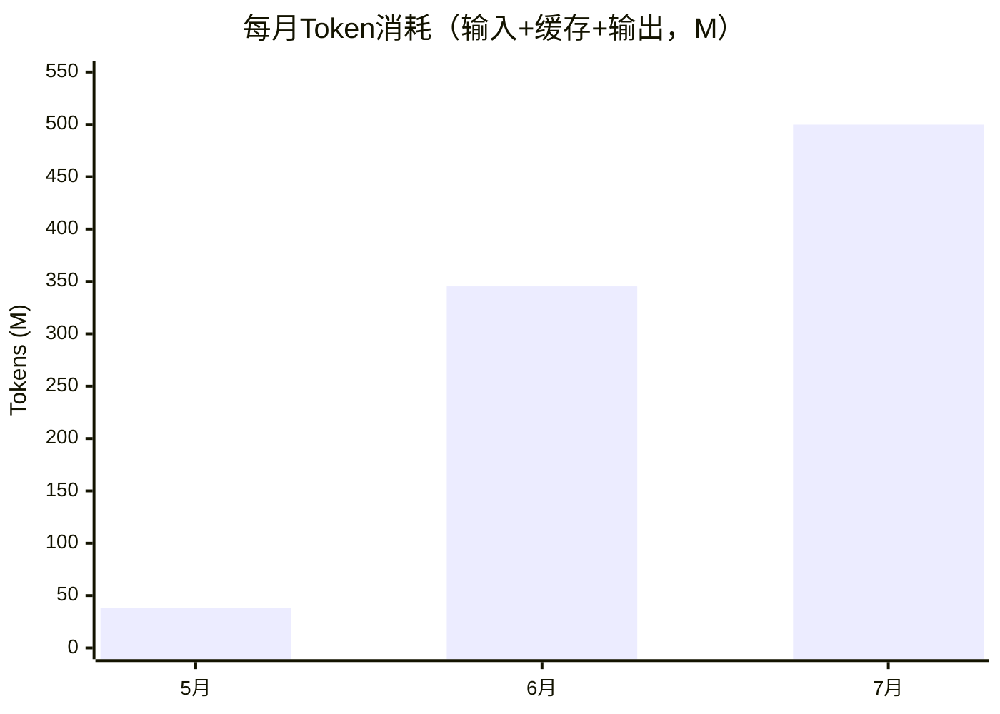
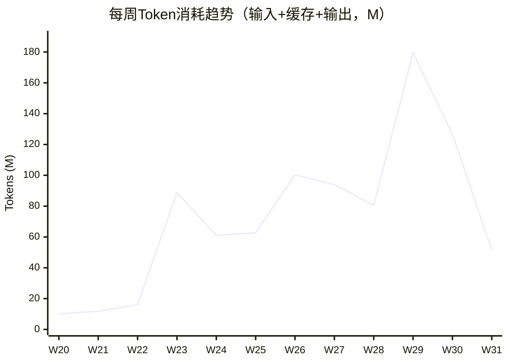

五月份把工作区托管给 [Multica](https://multica.ai/) 的时候，我还在美滋滋地盘算"让AI多干点活，我就能少加班了"。结果活儿确实没少干，Token账单却一路狂飙——前两天心血来潮拉了一份三个月的工作区统计，差点以为眼睛出了什么问题：**5月全月消耗约38M Token，到了7月直接干到约500M**，三个月合计更是达到了**883M**。这里就用数据记录一下这三个月Token是怎么"暴涨"的，顺便聊聊为什么涨——因为我的AI任务，已经从"尝鲜"变成了"离不开"。

<!-- more -->

## 数据来源

先交代数据和口径，免得后面的数字被误读。

**数据来源**：
- **Issue与Agent执行**：来自 `multica issue list` 和 `multica agent tasks`，覆盖工作区全部 **257个Issue、808次Agent执行**。
- **Token消耗**：来自各Runtime的每日聚合数据（`multica runtime usage`），按"日期 × Runtime × 模型"汇总。

**统计口径统一说明**：
- **输入Token** = 模型新处理的输入 + **缓存读取**；**输出Token** 单独统计。
- 全文Token统一以 **M（Million）** 为单位，免得一堆零看得头晕。
- 统计时间：覆盖**5~7月**，8月刚开头、数据不完整，就不拿来充数了。
- 局限说明：Token数据是Runtime级的日报聚合，平台目前无法精确到"某次执行用了多少"，只能反映整体趋势。另外5月份的时候因为设置容器的问题，数据丢失过一次，但是当时用量也不多，可能10～15M吧。

## 38M → 500M，三个月的Token暴涨

先看月度消耗量：

| 月份 | 输入Token(含缓存) | 输出Token | 合计 | 环比 |
|------|------------------|----------|------|------|
| 2026-05 | 37.85M | 0.30M | 38.15M | — |
| 2026-06 | 343.65M | 1.68M | 345.32M | **+805%** |
| 2026-07 | 497.75M | 2.08M | 499.82M | +45% |
| **三个月合计** | **879.24M** | **4.05M** | **883.29M** | |

从图上能非常直观地看到，**变化最大的是6月**——环比直接 **+805%**；7月又在6月的巨量基础上涨了45%。单看月度消耗，7月已经是5月的13倍。如果按周看，涨幅其实更猛：5月底每周还只有10M出头，6月就稳定在每周60~100M，7月中旬更是冲上了单周180M：

## 第三部分：任务在变：从"试试"到"离不开"

Token不会凭空涨。把三个月的Issue按创建时间切开看，原因就清楚了——**不是我同一件事干得更多了，而是让AI代劳的范围越拉越大了。**

| 月份 | Issue数 | 有Agent参与的Issue | Agent执行次数 | Agent参与率 |
|------|--------|-------------------|--------------|------------|
| 2026-05 | 62 | 15 | 60 | 24% |
| 2026-06 | 106 | 77 | 371 | 73% |
| 2026-07 | 71 | 50 | 352 | 70% |
| **合计** | **239** | **142** | **783** | **59%** |

这三个月内让AI代劳的方向如下：

**5月：代码阅读、分析环境准备与预跑。**
这个阶段Agent主要帮我读代码、搭分析环境、把已有的流程"预跑"一遍确认能不能跑通。Issue虽然不少（62个），但只有24%真正有Agent参与，多数还是我自己动手——Agent更像是个先帮我跑一遍，帮助踩雷的先锋。

**6月：从零开始的代码项目开发、问题处理与调研。**
6月是全面上手的一个月：从搭一个全新的代码项目开始，到处理开发过程中层出不穷的问题，再到干脆让Agent去做技术调研。有Agent参与的Issue比例一下涨到73%，执行了371次——Agent作为"主力干活的同事"来参与我的工作。

**7月：运行环境就绪后的独立测试、整理与对比任务。**
到7月，基础设施基本就绪，任务进一步升格：我开始安排Agent独立执行测试任务、整理数据与结果、做各种方案的对比分析。同时期间Multica也推出了他们的小队功能，所以我也有尝试多个Agent在同一个任务里分工协作的情况。Issue数量虽然少了，但单任务的深度和消耗更高——所以7月Token才会在6月的高基数上再涨45%。

## DeepSeek救我狗命

把每个月的Token（输入+缓存+输出）按模型系列拆开，走势非常有意思：

```mermaid
xychart-beta
    title "各模型系列月度Token消耗（输入+缓存+输出，M）"
    x-axis ["5月", "6月", "7月"]
    y-axis "Tokens (M)" 0 --> 280
    bar [26.4, 249.0, 219.8]
    bar [10.9, 58.0, 248.2]
    bar [0.9, 0.0, 19.2]
    bar [0.0, 38.4, 12.6]
```

如果按模型来看，可以看到我用的最多的还是deepseek，这个跟我入职后，deepseek就发布了v4有非常大的关系。不错的工具调用能力和低廉的价格，让我这3个月一直留在了deepseek这边，虽然后续的GLM5和Kimi-K3性能更胜一筹，但是要处理的工作这么多，其实只有deepseek才是实际用得起的。

## 小结

回头看这三个月，Token的暴涨曲线，其实就是我对AI依赖程度的曲线：

1. **任务面彻底变了**：从读代码、跑通流程，到从零开发、处理问题、技术调研，再到独立执行测试、整理与对比——AI一步步从"工具"变成了"同事"；
2. **依赖越来越深**：三个月合计883M Token，7月单月就近500M，我已经很难想象没有Agent的日子了；
3. **但依赖是有代价的**：Token是消耗品，用得越多，越要担心两件事——**钱**和**稳定性**。

所以接下来我的重点，已经从"让AI干更多活"，变成了"让AI稳定地干这么多活"：

- **控制费用**：把Token消耗做成自动统计，给不同任务分配合适的模型（能Flash就不上Pro），把每一分钱都花在刀刃上；
- **绕开用量限制**：为了避免买的套餐高频使用被"5小时用量限制"这类机制卡脖子，我准备引入一些工具和策略来分散、平滑用量——毕竟，如果正干到一半被限流，损失的就不只是Token，还有我的心情。
