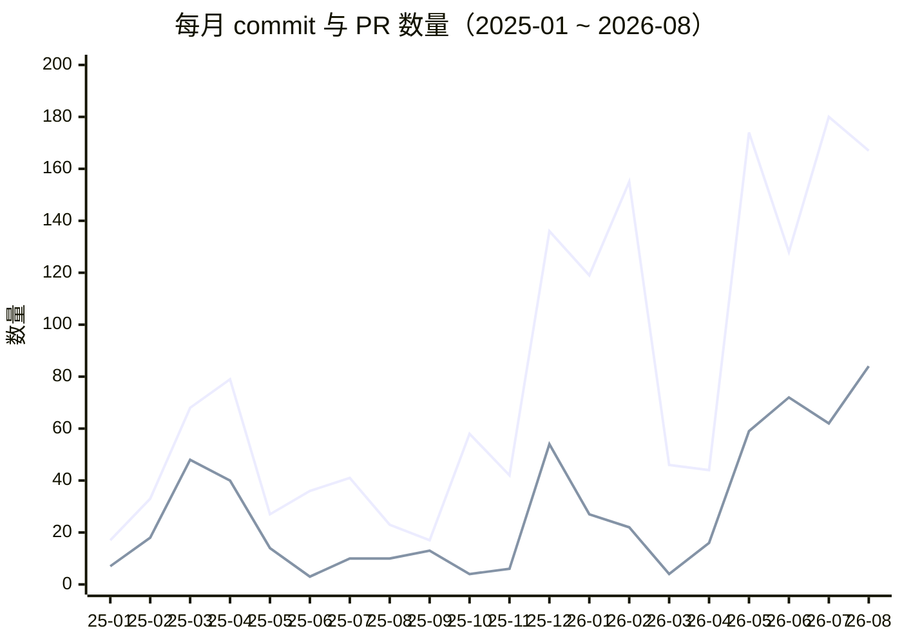
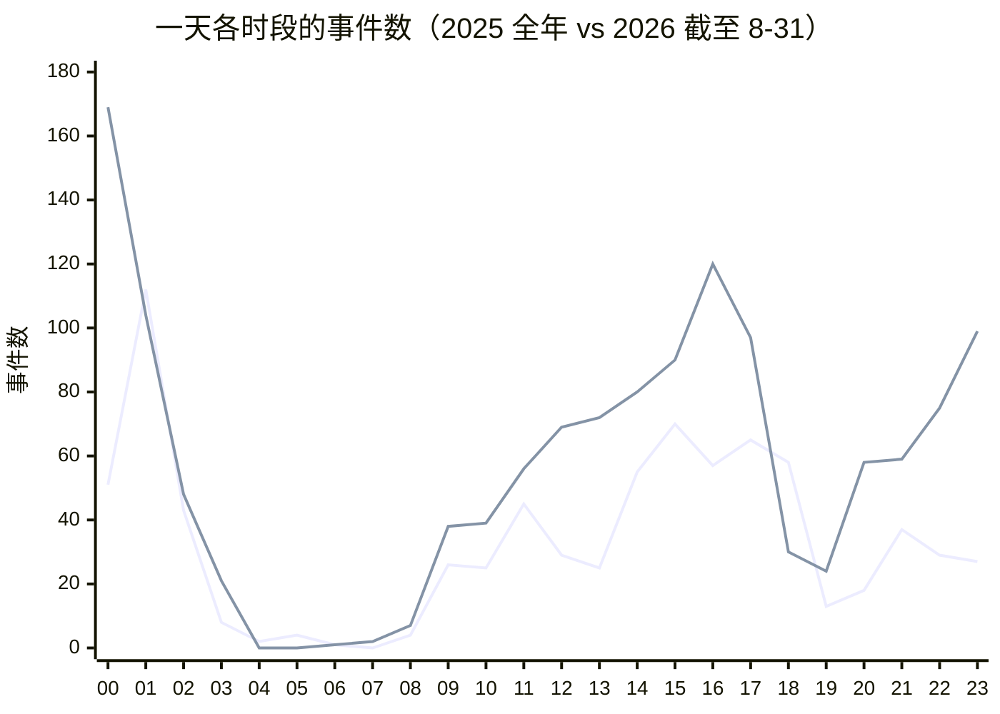
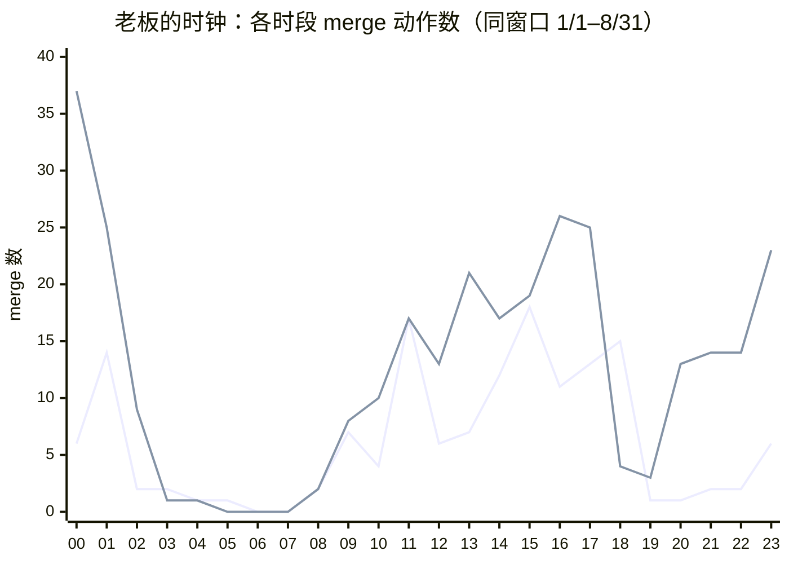
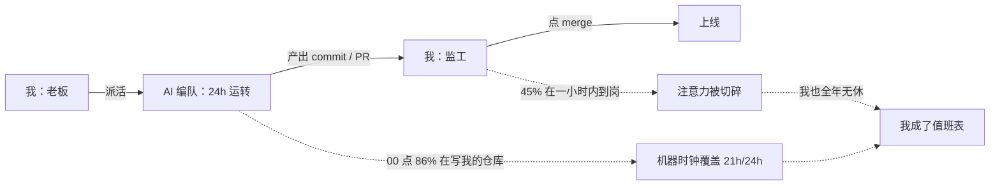

前段时间我跟朋友闲聊时放了一句话：「我感觉我用 AI 的这个强度，我当老板，我压榨手下人可能比我任何一个老板都狠。」说完我自己也有点好奇——这话到底有没有数据撑腰？于是我用 `gh` CLI 把自己 2025、2026 两年所有仓库（40+ 个）的 commit 和 PR 时间戳逐条拉了下来，从**数量**和**发生时间**两个维度做了分布分析（时区统一按 UTC+8）。

复盘的结果很有意思，但和这句话的直觉相反：**我确实养了一支"24 小时在岗、从不休周末、工资为零"的编队——可真正全年无休的，是我自己。**

<!-- more -->

## 数据和口径

先把口径交代清楚，免得数字被误读：

- **全账号口径**：覆盖 40+ 个仓库，包括 `aimingmed/*`、`VyBioTx/*` 等组织仓库，不只有博客。
- **时间轴**：commit 用 committer-date，PR 用 created_at 与 merged_at；全部折算到 UTC+8。
- **对比窗口**：尽量用「同长度窗口」2025-01-01 ~ 2025-08-31 vs 2026-01-01 ~ 2026-08-31（都是 243 天），这是唯一干净的比法；全文标注了「同窗口」的数字都是这个口径。
- **总量**：2025 全年 577 commits / 227 PRs；2026 至 8-31 共 1013 commits / 345 PRs。
- 数据截至 `2026-08-31T18:03+08:00`，`gh search` 单次上限 1000 条，已按半年/季度分段拉全（去重后 commits 1590、PRs 572，与 `total_count` 对账一致）。

## 数量维度：不是"多一点"，是 3 倍

同样是 1/1–8/31 的 243 天，两年的对比是这样的：

| 指标 | 2025 | 2026 | 倍数 |
|---|---|---|---|
| commits | 324 | 1013 | 3.13× |
| PRs | 150 | 345 | 2.30× |
| 工作事件合计 | 474 | 1358 | 2.86× |
| 活跃天数 | 111 | 171 | 1.54× |
| 事件 / 活跃日 | 4.27 | 7.94 | 1.86× |

单看 8 月更刺眼：2025-08 只有 23 commits / 10 PRs，2026-08 是 167 / 84——**7.3× 和 8.4×**。

但把每个月拆开看，增长是**台阶式**的，不是平滑爬坡：

*注：图里第一条线是 commit，第二条是 PR；2025 为全年，2026 为截至 8-31。*

两次起跳的原因完全不一样：

- **2025-12 那一次是纯人力赶工**，来自 `Aimingmed_Official_Website` 一个仓的单点冲刺（当月该仓 63 commits + 35 PRs，`2025-12-18` 一天就压了 41 个 commit），跟 AI 无关。
- **2026-05 之后的平台期才是 agent 时代**。这一跳之后 128 / 180 / 167 再没回落，这一年"越来越密"的部分，主要就是这次起跳之后没再下来造成的。

## 时间维度：确实是"越来越密、越来越长"

**变长了。** 用「当天首个到末个事件」的跨度衡量一天的工作时间（同窗口口径）：中位数从 **0.73 小时 → 5.86 小时**，均值 4.2h → 9.2h；单日跨度 ≥12 小时的日子从 12% 涨到 **39%**，≥18 小时从 3% 涨到 **25%**。2026-08 单独看更夸张：31 天里 30 天有活动，单日跨度中位数 **15.5 小时**，最长一天 23.6 小时；全年最长的是 `2026-07-04`，00:20 → 23:59 打了整整 23.7 小时。

**变密了。** 把「某个自然小时里有没有活动」当成一个格子来数：同窗口 2025 点亮 229 格，2026 点亮 **558 格（2.44×）**；2026-08 单月点亮过的小时格子已经从 10/24 涨到 19/24——白天到深夜几乎不留空档。

**形状变了，这点比总量更能说明问题。** 把一天 24 个小时画出来（下图用全年数据展示形状）：

*注：第一条线为 2025，第二条线为 2026。*

- **2025** 是一条「下午平台（14–18 点）+ 一根凌晨 01 点的尖刺（112 次）」；18 点（58 次）是最后一个高位小时，19 点直接断崖（13 次）——当天的工作到傍晚就收工了。
- **2026** 变成「09:00–17:00 铺满 + 22:00–01:00 一条粗尾巴」：**00 点以 169 次成为全年第 1 大小时**，23 点 99 次，20/21/22 点也分别有 58/59/75 次。**"下班"这个动作，在 2026 的曲线里已经找不到拐点了。**

同窗口口径的对比更直白：09–17 点的事件从 253 → 661（2.61×），而 19–02 点从 163 → **636（3.90×）**；00 点从 2025 同期的第 7 名（30 次）跃升为 2026 的第一大小时（169 次，5.6×）。

唯一的安慰是凌晨 03:00–07:59 这两年基本是空的（1.9% vs 1.8%），凌晨 04、05 点在 2026 全年一次都没有。所以不是"全天候"，是"醒着的时候都在"——底线还在，只是从 23:00 往后又吞了三个小时。

## 休息被结构性挤掉了

数量和时间之外，几项「结构性」指标比任何单日数字都更能说明问题（同窗口口径）：

| 指标 | 2025 | 2026 |
|---|---|---|
| 完全没有活动的日子 | 54% | **30%** |
| 周末事件占比 | 13.1% | **32.8%** |
| 单日跨度 ≥12 小时 | 12% | **39%** |
| 超过 36 小时的静默段 | 49 次 | 36 次 |
| 最长连续活跃天数 | 8 天 | **27 天** |
| "熬夜 + 早起"同日发生 | 9% | **22%** |

```mermaid
xychart-beta
    title "工作结构对比（同窗口 1/1–8/31，%）"
    x-axis ["完全空白天数","周末事件占比","单日跨度≥12h","夜间审批占比"]
    y-axis "占比(%)" 0 --> 60
    bar [54, 13.1, 12, 23]
    bar [30, 32.8, 39, 36]
```

*注：每组两根柱子，浅色为 2025，深色为 2026。*

几个值得单独拎出来的细节：

- **周末这个概念已经被磨平了。** 2026 年周日的 232 次、周六的 213 次，跟周一（210）、周三（203）基本是一个水平。
- **休假率直接减半**，最长一次连续休假从 9.8 天缩到 7.7 天（`2026-03-22 → 03-29`）；36 小时以上的静默段从 49 次减到 36 次——休息不是变多了，是被切得更碎。
- **深夜在干谁的活也变了。** 按"属于个人账号 `SilenWang/*` 的事件占比"来算：2025 年 01 点是 46%，2026 年 00 点是 **86%**、23 点是 **85%**，而 16 点只有 39%。换句话说：**白班主要给组织仓库干活，00 点和 23 点几乎全在给自己干活。**这条"白班/夜班按雇主分界"的线，在 2025 年还不存在。

## 反转：代码其实都是 AI 写的

到这里我必须先纠正自己一个错误。最初的版本里，我拿 commit message 里的 `Co-authored-by: multica-agent` / aider / opencode 痕迹做人机拆分，得出过"agent 只扛了 1/3 增量"的结论。但这判据不成立——**这两年的代码基本都是 agent 写的，本地 opencode 提交根本不署名**。我等于把大量 agent 产出错算成了人手写。

想清楚这点之后，一个更重要的推论浮出来了：**commit 时间戳测的是机器编队的时钟，不是我的时钟。** 之前所有"我亲自肝到凌晨 00 点"的推论，其实没有证据支撑。

## 老板的时钟：merged_at

写代码可以外包，点 merge 不行。所以我把全量 PR 按 `merged_at − created_at` 拆开，用 **merge 动作**来描画老板本人（也就是我）的时钟：

- **<60 秒 = 自动化**：2025 有 81% 的 PR 秒合（`via upgit client` 那批批量同步），2026 只剩 34%。
- **≥5 分钟 = 需要有人醒着决策**：这类审批同窗口从 23 次涨到 **173 次（7.5×）**。

先验证这个信号不是定时任务伪装的：2026 年 72 次深夜审批（22:00–05:59）里，落在整 5 分钟倍数的只有 19%（纯随机基线是 20%），落在 `:00–:04` 的只有 8%（基线 20%），用到的分钟数 38/60——**分布是散的，这是人手点出来的时间戳**。

把全部 merge 动作（同窗口 1/1–8/31）按小时画出来：

*注：第一条线为 2025，第二条线为 2026。*

老板本人的时钟同样在变狠：

| 指标 | 2025 | 2026 |
|---|---|---|
| 有审批动作的天数 | 69/243（28%） | **120/243（49%）** |
| 22:00–06:00 占比 | 23% | **36%** |
| 00:00–02:59 次数 | 22（15%） | **71（24%）** |
| 周末占比 | 6% | **30%** |
| 18:00 / 00:00 对比 | **15 次** / 6 次 | 4 次 / **37 次** |
| 单日动作跨度 | 中位 0.5h，≥12h 占 6% | 中位 1.1h，**≥12h 占 23%** |
| 最长连续出勤 | 6 天 | **13 天** |

注意看 18:00 和 00:00 这两根柱子：**18:00 这个原本的收工时段从 15 次掉到 4 次，00:00 从 6 次涨到 37 次。** 上一版说的"下班拐点消失"，在老板自己的时钟上同样成立。⚠️ 这里要说明一个偏向：≥5 分钟的审批子集里有 164 次集中在 2026-05 之后，2025-09~12 整整 90 天没有任何一次人工审批——所以"2025 老板夜里只 13%"不可靠，不是他不起夜，是当年那套流程里根本没有"人工验收"这一环。上面这张表用的是全部 merge 动作，避开了这个混淆。

## 结论：你不是压榨员工，你把自己变成了瓶颈

把两边拼起来看。机器那侧的盘子大得离谱：非 merge 的内容 commit 从 154 涨到 **726（4.7×）**，出勤天数从 53 涨到 144，一天里点亮的自然小时从 19/24 到 **21/24**——一支「每周上 4.2 天班、每天横跨 21 小时、从不休周末、工资为零」的编队。按任何劳动法算，这确实"比任何一个老板都狠"。

但这不构成道德事实，也不会产生疲劳。真正被换掉的，是老板的岗位：**我从写代码的人，变成了给机器排队放行的人。** 而放行这件事，正在把我压成瓶颈：

- 审批等待中位数 **12.2 小时 → 1.5 小时**（快了 8 倍）
- 当天开当天合从 48% → **71%**；**45% 的审批在 PR 开出后 1 小时内完成**
- 秒合比例从 81% → 34%：2025 是脚本自己合完拉倒，2026 是**每一批都得有人醒着点一下**

机器不需要你，但你需要一直看着机器。**2026 年我有 49% 的日子必须出现在 GitHub 上，51% 的出勤日出现过深夜操作**（2025 年这两个数字是 28% 和 30%）。这不是活多到要你干，是活多到要你签字：

所以那句话最终被数据改成了这样：

> ~~我压榨手下人比任何老板都狠~~
> **我给手下（机器）排了 24 小时的班，然后为了不让他们闲着，把自己排成了他们的值班表。**

员工不累，老板全年无休，而且 45% 的班次要求 1 小时内到岗。这段雇佣关系里唯一真实的成本，是我的注意力被切成了随时待命——机器把"加班"从一种惩罚变成了一种默认配置，而被配置的那个人，不在机器那一侧。

## 口径与局限

- **老板时钟 = PR `merged_at`**（主口径取全部 merge，辅口径取 ≥5 分钟延迟子集）；**机器时钟 = 非 merge 内容 commit**。全 UTC+8，主表用同窗口 1/1–8/31。
- `merged_at` 不是纯人工信号：GitHub auto-merge / CI 绿了自动合也会写这个字段。我用两道过滤压噪声（剔 <60s 秒合 + 分钟随机性检验），但残余污染无法排除，"值班表"部分按上限读；夜间/周末恶化那部分是稳的。
- **commit 数 ≠ 工作量**。数字里混着 `pixi.lock`、博客 post、`via upgit client` 批量同步（21 次）以及 2026-01-21 那 4 条 FydeOS 重放（committer-date 与 author-date 相差 751 小时），它们都不构成真实工时——所以本文优先看分布指标（小时格、单日跨度、静默段），而不是总数指标。committer-date 与 author-date 有 1579/1590 条完全一致，重放污染极小。
- `silen_blog` 单仓 2025 是 141 commits / 46 活跃天 → 2026 是 217 commits / 54 活跃天 / 64 PRs，涨幅远低于全局，说明增长主要来自多仓并行，而不是博客本身。
