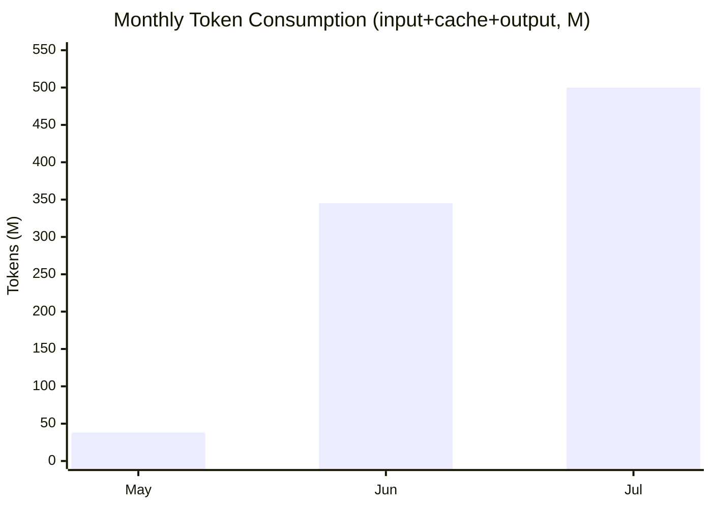
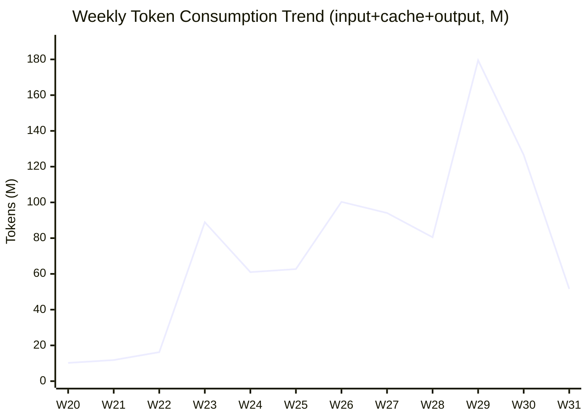

When I handed my workspace over to [Multica](https://multica.ai/) back in May, I was happily picturing how letting AI take on more of the work would mean fewer late nights for me. The work did get done — but my token bill went through the roof. The other day I pulled a three-month usage report for the workspace out of curiosity, and I had to double-check that I was reading it right: **about 38M tokens in May, jumping to nearly 500M in July**, with a three-month total of **883M**. So here's a data-driven look at how my token consumption exploded over those three months — and why. Because my AI tasks have gone from "trying it out" to "can't live without it".

<!-- more -->

## Data Source

Let me lay out the data and the accounting rules first, so the numbers below don't get misread.

**Data sources**:
- **Issues & agent runs**: from `multica issue list` and `multica agent tasks`, covering all **257 issues and 808 agent runs** in the workspace.
- **Token usage**: from the per-runtime daily aggregation (`multica runtime usage`), aggregated by date × runtime × model.

**Accounting notes**:
- **Input tokens** = fresh input + **cache reads**; **output tokens** are counted separately.
- All token figures are in **M (million)** so we don't drown in zeroes.
- The stats cover **May–July**; August has only just started and the data is incomplete, so it's left out.
- A caveat: token data is a runtime-level daily aggregation — the platform can't attribute usage to a single run, so these numbers only show the overall trend. Also, in May some data was lost once due to a container setup issue, but usage was small back then — maybe 10–15M.

## 38M → 500M: The Three-Month Token Explosion

Let's start with the monthly numbers:

| Month | Input tokens (incl. cache) | Output tokens | Total | MoM |
|-------|---------------------------|---------------|-------|-----|
| 2026-05 | 37.85M | 0.30M | 38.15M | — |
| 2026-06 | 343.65M | 1.68M | 345.32M | **+805%** |
| 2026-07 | 497.75M | 2.08M | 499.82M | +45% |
| **Three-month total** | **879.24M** | **4.05M** | **883.29M** | |

The chart makes it obvious that the biggest jump came in June — **up +805% month-over-month**; July then added another 45% on top of that already-huge base. In absolute terms, July's monthly consumption was already **13×** May's. The weekly numbers are even more dramatic: a bit over 10M per week at the end of May, a steady 60–100M per week through June, and a single week in mid-July pushing past 180M:

## Tasks in Change: From "Trying It Out" to "Can't Live Without It"

Tokens don't grow out of thin air. Slice the issues by creation month and the reason is obvious — **it's not that I did more of the same thing; it's that the scope of what I let AI take over kept expanding.**

| Month | Issues | Issues with agent involvement | Agent runs | Agent involvement rate |
|-------|--------|-------------------------------|------------|------------------------|
| 2026-05 | 62 | 15 | 60 | 24% |
| 2026-06 | 106 | 77 | 371 | 73% |
| 2026-07 | 71 | 50 | 352 | 70% |
| **Total** | **239** | **142** | **783** | **59%** |

Here's how the work I delegated to AI evolved over those three months:

**May: reading code, preparing analysis environments, and trial runs.**
In this phase the agents mostly read code for me, set up analysis environments, and "trial-ran" existing pipelines to confirm they actually worked. There were quite a few issues (62), but only 24% really involved an agent — most of the work was still on me. The agents were more like scouts who went first and took the hits for me.

**June: building code projects from scratch, fixing problems, and doing research.**
June was the month I went all in: from scaffolding brand-new code projects, to handling the endless problems that pop up during development, to simply handing research tasks to agents. The share of issues with agent involvement jumped to 73% with 371 runs — agents had become the workhorse colleagues doing real work on my team.

**July: independent testing, organizing, and comparison tasks once the environment was ready.**
By July the infrastructure was mostly in place and the tasks moved up a level: I started having agents independently run tests, organize data and results, and compare different approaches. Around the same time Multica rolled out their squad feature, so I also tried having multiple agents collaborate on a single task. The number of issues went down, but the depth — and the cost — of each task went up. That's why July's tokens grew another 45% on top of June's already-large base.

## DeepSeek to the Rescue

Splitting each month's tokens (input + cache + output) by model family paints a very interesting picture:

```mermaid
xychart-beta
    title "Monthly Token Consumption by Model Family (input+cache+output, M)"
    x-axis ["May", "Jun", "Jul"]
    y-axis "Tokens (M)" 0 --> 280
    bar [26.4, 249.0, 219.8]
    bar [10.9, 58.0, 248.2]
    bar [0.9, 0.0, 19.2]
    bar [0.0, 38.4, 12.6]
```

Looking at the models, it's clear I've been leaning on DeepSeek the most — which has a lot to do with the fact that DeepSeek released V4 right around the time I joined the company. Solid tool-calling ability and a cheap price are why I've stayed with DeepSeek for these three months. Even though GLM5 and Kimi-K3 later came out with better performance, with this much work to get through, DeepSeek is honestly the only one I can practically afford.

## Summary

Looking back, the curve of my exploding token usage is really the curve of how dependent I've become on AI:

1. **The scope of tasks has completely changed**: from reading code and getting pipelines to run, to building projects from scratch, fixing problems and doing research, to independently running tests, organizing and comparing — AI has gradually gone from a "tool" to a "colleague".
2. **The dependency keeps deepening**: 883M tokens over three months, nearly 500M in July alone — I can barely imagine working without agents now.
3. **But dependency has a price**: tokens are a consumable; the more you use, the more you have to worry about two things — **money** and **stability**.

So my focus has shifted from "getting AI to do more work" to "getting AI to reliably do this much work":

- **Controlling costs**: set up automatic token-usage tracking and assign the right model to each task (if Flash can do it, don't reach for Pro), so every penny is spent where it counts;
- **Working around usage limits**: to avoid getting throttled by mechanisms like the "5-hour usage limit" when I hammer a paid subscription, I'm planning to bring in some tools and strategies to spread out and smooth the usage — because if I get rate-limited mid-task, it's not just tokens I lose, it's my sanity.
