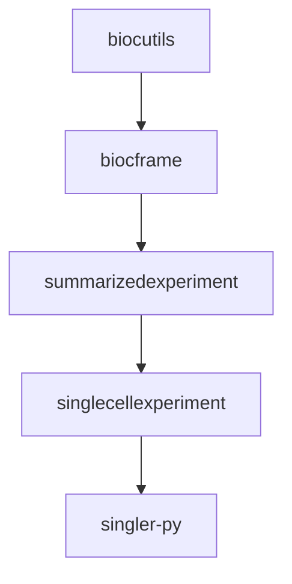

After my previous small contribution to a conda‑forge package, I wanted to take on something more advanced: trying to publish the [singler‑py](https://github.com/SingleR-inc/singler-py) Python package into the conda ecosystem. Little did I know that it would turn out to be… somewhat troublesome.

<!-- more -->

## Rome Wasn’t Built in a Day

I originally thought that setting up a recipe, submitting it once, and getting it approved would be enough. However, I encountered the following issues:

- I initially planned to submit directly to **conda‑forge**, but after reading the contribution guidelines, I discovered that software specifically aimed at bioinformatics should be submitted to the **Bioconda** channel first.
- After reading the **Bioconda** documentation and trying step by step, I found that many of the packages singler‑py depends on are not available in any conda channel. The AI informed me that the official recommendation is not to submit multiple new packages in the same PR, so I had to start from the bottom of the dependency tree, one by one.
- Parsing the dependencies level by level, I realized that a whole series of packages under BiocPy are not yet in the Conda ecosystem…

After sorting out the dependencies, the build work required for singler‑py actually forms a layered dependency tree. Starting from the lowest level, **biocutils**, then moving up to **biocframe**, **summarizedexperiment**, and **singlecellexperiment**, and finally **singler‑py** itself. So far, the known dependency tree looks like this:



As you can see, completing the conda release of singler‑py requires at least **4 levels** of build work. Assuming a review cycle of 2‑3 working days per level, the entire chain would take about 3‑4 weeks. In reality, more dependent packages are likely to be discovered along the way… probably even longer.

## Different Recipe Workflows for conda‑forge and Bioconda

Since I actually got to understand the workflows of both sides, I’ll document them here.

### A Brief Introduction to conda‑forge and Bioconda

[conda‑forge](https://conda-forge.org/) is a community‑led conda software package repository that covers a large number of open‑source software in general domains. Anyone can submit new recipes to its [staged‑recipes](https://github.com/conda-forge/staged-recipes) repository via GitHub. After automated checks and maintainer review, the new package appears in the `conda‑forge` channel, available worldwide via `conda install -c conda-forge <package>`. In nature, it should be similar to the AUR.

[Bioconda](https://bioconda.github.io/) is a conda channel focused on bioinformatics software, a repository specifically dedicated to biology‑related packages. The documentation also emphasizes that if a package does not specifically serve a biological purpose, it should be submitted to the `conda‑forge` channel.

The tools for managing and generating recipes overlap between the two, but the actual recipe organization differs. `conda‑forge` provides a recipe template; after submitting a recipe, the CI workflow generates a feedstock repository, and subsequent maintenance is done in that feedstock repository—hence a “one‑package‑one‑repo” model.

Bioconda, on the other hand, keeps all recipes in a single centralized repository, and you simply submit a PR directly to that repository. The difference probably stems from the number of packages: bioinformatics is a branch of data science, so the number of tools is much smaller than that of conda‑forge, and the number of people willing to maintain and contribute… is likely even smaller (having usable code is already good enough… don’t expect too much standardization and packaging).

### Tool Preparation

For this attempt, I temporarily used the conda toolset—after all, I’m a beginner following the official documentation… All the tools can be obtained via pixi by running:

```bash
pixi global install --environment conda -c conda-forge -c bioconda conda conda-build bioconda-utils greyskull grayskull 
```

There’s a small Easter egg here: both `greyskull` and `grayskull` exist, but they actually point to the same `grayskull`. One page of the Bioconda documentation mentions `greyskull`—I wonder if there was a small mistake at the beginning of the project…

### Brief Steps for Submitting a New Package to conda‑forge

The conda‑forge approach is to first submit a recipe, generate a feedstock, and then maintain the feedstock.

1. **Fork the Repository**  
   Visit [conda‑forge/staged‑recipes](https://github.com/conda-forge/staged-recipes) and click the “Fork” button to copy the repository to your own GitHub account.

2. **Prepare the Local Environment**  
   Clone your forked repository and create a new branch:
   ```bash
   git clone https://github.com/<your-username>/staged-recipes.git
   cd staged-recipes
   git checkout -b add-<package-name>
   ```

3. **Generate the Recipe Files**  
   Since the package I submitted is already on PyPI, simply run `grayskull pypi --strict-conda-forge <package-name>`.

4. **Local Validation**  
   Use the `conda smithy` tool to run lint and build tests locally (requires installing `conda‑smithy` first):
   ```bash
   conda smithy recipe-lint recipes/<package-name>/
   conda build recipes/<package-name>/
   ```

5. **Submit a PR**  
   Push your changes to your fork, then open a Pull Request to `conda‑forge/staged‑recipes` via the GitHub interface. The CI will automatically run multi‑platform build tests, and maintainers will provide feedback in the comments until all checks pass and the PR is merged.

### 3. Brief Steps for Submitting a New Package to Bioconda

1. **Fork the Repository**  
   Visit [bioconda/bioconda‑recipes](https://github.com/bioconda/bioconda-recipes) and fork it to your account.

2. **Prepare the Local Environment**  
   Clone the repository and create a branch (again, it’s recommended to include the package name in the branch name):
   ```bash
   git clone https://github.com/<your-username>/bioconda-recipes.git
   cd bioconda-recipes
   git checkout -b add-<package-name>
   ```

3. **Generate the Recipe Files**  
   Simply run `grayskull pypi <package-name>`.

4. **Validate with bioconda‑utils**  
   Bioconda provides a dedicated toolchain for testing recipes:
   ```bash
   # Run lint checks
   bioconda-utils lint recipes/<package-name>/

   # Build test
   conda build recipes/<package-name>/
   ```

5. **Submit a PR**  
   Push to your fork and open a PR to `bioconda/bioconda‑recipes`. Bioconda’s CI will perform stricter bioinformatics software compatibility tests, and you’ll need to wait for maintainer review and approval.

## A Small Discovery

While checking the syntax of the package build files, I noticed that conda has now introduced parallelism. Previously, downloading package configuration files for different platforms was serial; even with acceleration in mainland China, it would take several minutes, not to mention the subsequent dependency calculations. The introduction of parallel mechanisms is definitely an improvement (though I’ll still keep using Pixi).

Additionally, I recall that Pixi uses newer package‑building tools, which might be faster than conda. Next time I submit something else, I’ll definitely give it a try.

## Afterword

Back when I was working in Tianjin (seven years ago already…), I thought about compiling conda packages myself to solve the problem of installing bioinformatics software without root privileges. However, the documentation at that time was completely incomprehensible to me… let alone writing it. Now, with highly automated tools and AI assistance… it’s finally possible to make some contributions.

## Practical Submission Attempt for BiocUtils 0.3.3

Applying the aforementioned content, I [attempted to submit BiocUtils to Bioconda](https://github.com/bioconda/bioconda-recipes/pull/61831).

During the process, I gained a few somewhat awkward experiences:

- The documentation stating the need to specify a software license does **not** mean attaching the license file to the recipe itself, but rather **specifying its location within the original project**.
- Bioconda does **not** provide packages for older versions of Python, so there is no need to ensure compatibility for versions below 3.9.
- The content automatically parsed by `conda-build` is not always accurate. For example, BiocUtils' original PyPI dependency specifies `python >= 3.9`, but this constraint was **not captured in the parsed recipe**.

Additionally, once a package is submitted to Bioconda, subsequent new versions can be **automatically parsed based on updates to the source code**. Therefore, unless there are specific issues, there is no need to update the recipe for every new release.