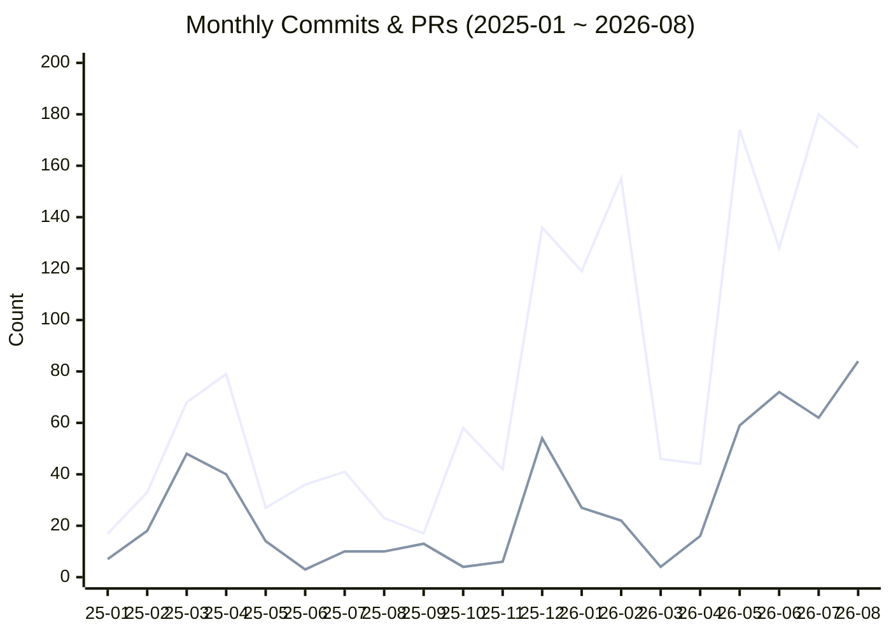
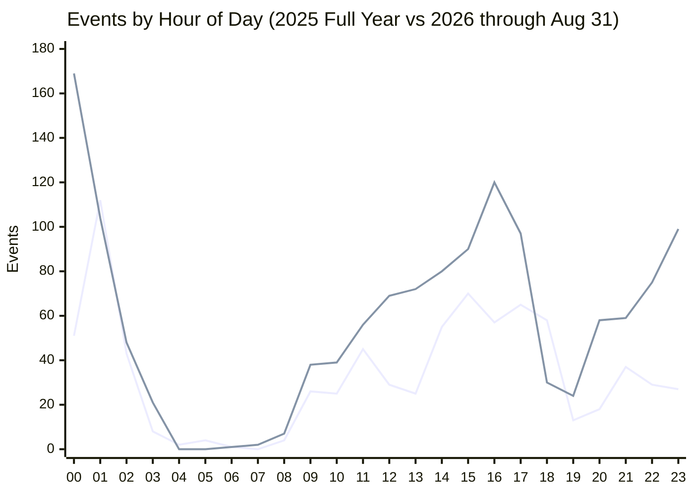
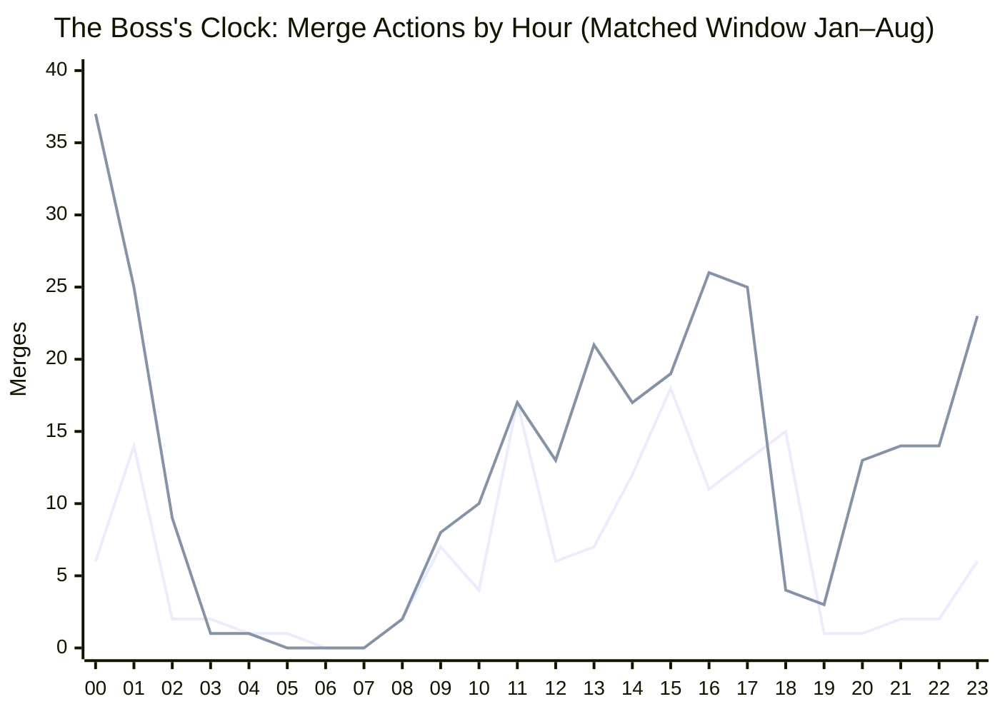
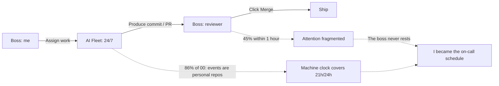

The other day I joked to a friend: "If I were a boss, I'd exploit my employees harder than any of my bosses ever did — just look at how hard I work my AI agents." Curious whether that was actually true, I used the `gh` CLI to pull every commit and PR timestamp across all my repositories (40+ repos) from 2025 and 2026, then analyzed the distribution from two angles: **volume** and **timing** (all timestamps in UTC+8).

The numbers tell a different story than I expected: **I do have a fleet that works 24/7, never takes weekends, and costs zero salary — but the one who never takes a break is me.**

<!-- more -->

## Data & Methodology

| Detail | Value |
|---|---|
| Scope | All repos across the account (40+, including `aimingmed/*`, `VyBioTx/*`, personal repos) |
| Timestamps | Commit = committer-date; PR = created_at / merged_at; all in UTC+8 |
| Matched window | Jan 1 – Aug 31 for both years (243 days each) — the only clean comparison |
| Full-year totals | 2025: 577 commits / 227 PRs; 2026 (through Aug 31): 1013 commits / 345 PRs |
| Data cutoff | `2026-08-31T18:03+08:00`; paginated by half-year/quarter to bypass the 1000-result limit (deduplicated: 1590 commits, 572 PRs, verified against `total_count`) |

## Volume: Not "a Bit More" — More Than Three Times

Same window (Jan 1 – Aug 31, 243 days each):

| Metric | 2025 | 2026 | Multiple |
|---|---|---|---|
| Commits | 324 | 1013 | 3.13× |
| PRs | 150 | 345 | 2.30× |
| Total events | 474 | 1358 | 2.86× |
| Active days | 111 | 171 | 1.54× |
| Events / active day | 4.27 | 7.94 | 1.86× |

August alone is the starkest: 2025-08 had 23 commits / 10 PRs; 2026-08 had 167 / 84 — **7.3× and 8.4×**.

But the growth is **stepped**, not smooth:

*First series = commits; second series = PRs. 2025 is full year; 2026 through Aug 31.*

Two step-ups with totally different causes:

- **2025-12: human crunch.** A single-repo sprint on `Aimingmed_Official_Website` (63 commits + 35 PRs that month; `2025-12-18` alone had 41 commits). Nothing to do with AI.
- **2026-05 onward: the agent era.** After May, the monthly count stayed at 128 / 180 / 167 and never dropped. This plateau is responsible for most of the "getting denser" narrative.

## Timing: Definitely "Getting Denser and Longer"

**Days got longer.** Median daily span (first event → last event, matched window): **0.73h → 5.86h**; mean: 4.2h → 9.2h. Days with ≥12h span: 12% → **39%**; ≥18h: 3% → 25%. In 2026-08 alone: **30 out of 31 days active**, median span **15.5h**, longest 23.6h. The year's longest day was `2026-07-04`: 00:20 → 23:59, a full 23.7 hours.

**Days got denser.** Counting each natural hour that had at least one event: the matched window lit 229 slots in 2025 vs **558 slots (2.44×)** in 2026. In 2026-08, the covered slots grew from 10/24 to **19/24** — day to late-night, almost no empty gaps.

**The shape changed — that tells more than any total:**

*First series = 2025; second = 2026.*

- **2025**: an afternoon plateau (14–18h) + a spike at 01:00 (112 events). 18:00 (58) was the last high hour; 19:00 dropped off a cliff (13). Work wrapped up in the evening.
- **2026**: 09:00–17:00 filled solid + a thick tail from 22:00–01:00. **00:00 became the #1 hour at 169 events.** 23:00 hit 99, and 20/21/22h each had 58/59/75. **The "quitting time" inflection point is gone from the 2026 curve.**

Matched-window ratios are even sharper: 09–17 events went from 253 → 661 (2.61×), while **19–02 went from 163 → 636 (3.90×)**. Hour 00 jumped from 7th place (30 events in 2025) to #1 (169, **5.6×**); hour 23 from 19 to 99.

The only consolation: 03:00–07:59 is essentially empty both years (1.9% vs 1.8%). 04:00 and 05:00 never registered a single event in 2026. So it's not "24/7" — it's "all waking hours." The baseline still exists, just three hours later than it used to be.

## Rest Got Structurally Squeezed

| Metric | 2025 | 2026 |
|---|---|---|
| Completely empty days | 54% | **30%** |
| Weekend event share | 13.1% | **32.8%** |
| Days with span ≥12h | 12% | **39%** |
| Silent periods >36h | 49 | 36 |
| Longest active streak | 8 days | **27 days** |
| "Night owl + early bird" same day | 9% | **22%** |

```mermaid
xychart-beta
    title "Work Structure Comparison (Matched Window Jan–Aug, %)"
    x-axis ["Empty Days","Weekend Share","Days ≥12h Span","Night Merges"]
    y-axis "%" 0 --> 60
    bar [54, 13.1, 12, 23]
    bar [30, 32.8, 39, 36]
```

*First bar = 2025; second bar = 2026.*

A few details worth calling out separately:

- **Weekend is no longer a thing.** In 2026, Sunday (232 events) and Saturday (213) track almost identically to Monday (210) and Wednesday (203).
- **Vacation time literally halved.** The longest continuous break shrank from 9.8 days to 7.7 days (2026-03-22 → 03-29). Periods of silence >36h fell from 49 to 36 — rest is not more abundant, just more fragmented.
- **Who the boss serves at night also changed.** Events in personal repos (`SilenWang/*`) were 46% of 01:00 in 2025; in 2026, 00:00 is **86%** personal and 23:00 is **85%** personal, while 16:00 is only 39% personal. The day shift is org work (`aimingmed/*`, `VyBioTx/*`); the night shift is personal projects — a line that literally didn't exist in 2025.

## The Big Correction: The Code Was All Written by AI

I have to correct my own first attempt here. In the initial version, I split human vs machine by checking commit messages for `Co-authored-by: multica-agent`, aider, or opencode footprints, and concluded "agents only carried 1/3 of the increment." That assumption was wrong — **the user confirmed that the vast majority of code this past year-plus was written by agents running opencode locally, which doesn't leave a signature in the commit message.** I had misattributed massive machine output as human work.

Once you internalize that, a more important realization follows: **commit timestamps measure the machine fleet's clock, not the boss's clock.** All those "you personally coding until 00:00" inferences from the first pass have no evidentiary basis.

## The Boss's Clock: `merged_at`

Coding can be outsourced; clicking Merge cannot. So I pivoted to PR `merged_at` as the reliable signal of human presence:

- **<60s = automated**. Of merged PRs, 81% were instant-merged in 2025 vs **34%** in 2026.
- **≥5min = requires a conscious human decision**. These grew from 23 → **173 (7.5×)** in the matched window.

A cron-sanity check on the 2026 late-night approvals (22:00–05:59, n=72): only **19%** fell on multiples of 5 minutes (random baseline 20%), only **8%** landed in the `:00–:04` bucket (baseline 20%), and the timestamps used 38 distinct minutes out of 60. **This is a human hand on the mouse, not a cron job.**

Hourly breakdown of ALL merge actions (matched window):

*First series = 2025; second = 2026.*

The boss's own clock shows the same degradation:

| Metric | 2025 | 2026 |
|---|---|---|
| Days with any merge action | 69/243 (28%) | **120/243 (49%)** |
| Night 22–06 share | 23% | **36%** |
| 00–02 share | 22 (15%) | **71 (24%)** |
| Weekend share | 6% | **30%** |
| 18:00 vs 00:00 | **15** / 6 | 4 / **37** |
| Day span ≥12h | 6% | **23%** |
| Longest streak | 6 days | **13 days** |

Notice 18:00 dropping from 15 to 4 and 00:00 jumping from 6 to 37. The "quitting time" phenomenon is just as real on the boss's clock as it is on the event curve. (A necessary caveat: 164 of the 173 ≥5min approvals are concentrated after 2026-05; 2025 had virtually no human approvals between September and December — not because the boss never stayed up, but because the workflow didn't have a "human review" gate back then. The table above uses ALL merges to avoid this confound.)

## Conclusion: You're Not Exploiting Employees — You Made Yourself the Bottleneck

Put the machine side in the proper light: non-merge content commits grew from 154 → **726 (4.7×)**, attending days from 53 → 144, hourly coverage from 19/24 → **21/24**. A fleet that "works 4.2 days per week, spans 21h per day, never rests weekends, salary zero." By labor law that is indeed "harsher than any boss."

But it generates no fatigue and has no moral weight. What actually happened is that the boss's job description changed: **I went from being the person who writes code to the person who waves PRs through.** And waving things through is squeezing me into the bottleneck:

- Approval wait median **12.2h → 1.5h (8× faster)**
- Same-day open → merge: 48% → **71%**; **45% of approvals happen within 1 hour of the PR**
- Instant auto-merge: 81% → 34% — every batch now requires a conscious human click

The machine doesn't need you. But you need to watch the machine all the time. **In 2026, 49% of my days required me to show up on GitHub, and 51% of those attendance days included a late-night operation** (2025: 28%, 30%). It's not that there's too much work to do — it's that there's too much work to **approve**.

So the quote that started this whole exercise ends up rewritten:

> ~~I'd exploit employees harder than any of my bosses~~  
> **I put my AI fleet on a 24/7 shift, and then scheduled myself as their on-call person so they'd never sit idle.**

The employee isn't tired; the boss doesn't have a day off, and 45% of the shifts require a 1-hour response time. The only real cost in this employment relationship is the boss's attention, reduced to constant standby — the machine has turned "overtime" from a penalty into a default configuration, and the person being configured isn't on the machine side.

## Caveats & Limitations

- **Boss's clock = PR `merged_at` (primary: ALL merges; auxiliary: ≥5min latency subset); Machine clock = non-merge content commits.** All UTC+8. Primary comparisons use the matched Jan–Aug window.
- `merged_at` isn't purely human: GitHub auto-merge and CI-pass → auto-merge also write this field. Two filters (exclude <60s instant merges + minute-randomness test) reduce noise but cannot eliminate it entirely. The "on-call" conclusion should be read as an upper bound; the night/weekend degradation is robust.
- **Commit count ≠ workload.** The numbers include `pixi.lock` updates, blog posts, `via upgit client` batch syncs (21 instances), and 4 FydeOS replays on 2026-01-21 (committer-date vs author-date off by 751h). None represent actual engineering time — which is why this post prioritizes distribution metrics (hour slots, day span, quiet periods, merge timestamps) over raw counts. 1579/1590 commits have matching committer/author dates; replay contamination is minimal.
- The `silen_blog` repo alone: 2025→141 commits / 46 active days→2026→217 commits / 54 active days / 64 PRs. Growth there is far below the global average, confirming that the volume increase comes from parallel activity across many repos, not just more blog posts.